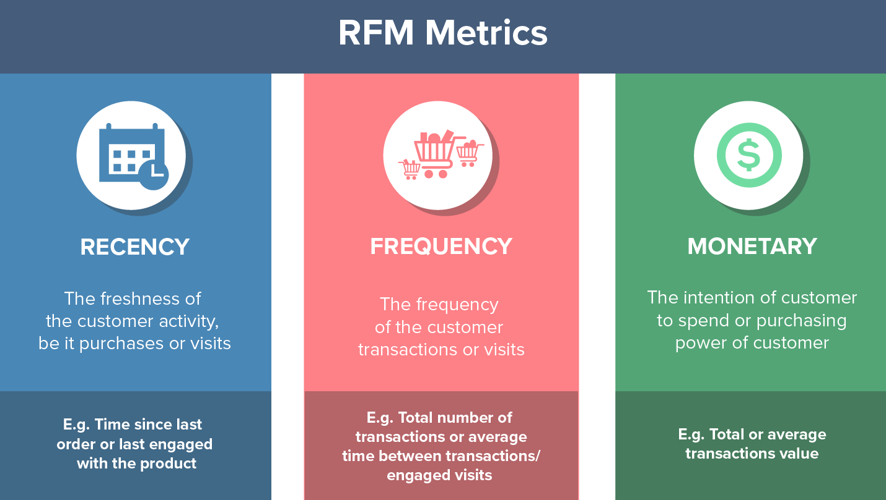

# RFM_Analysis
Customer Segmentation (RFM &amp; Cohort Analysis)

# RFM (Recency, Frequency, Monetary) Analizi Nedir? Neden Yapılır? Nasıl Kullanılır.
Veri dünyada olduğu gibi ülkemizde de önemini arttıran bir konu olduğunu düşünüyorum. Toplanan verilerden anlamlar çıkartmak adına hedeflenen amaçlara yönelik birçok yöntem ve algoritma mevcuttur. Bu yöntemlerden biri de RFM Analizi yöntemidir. Genel olarak Online alışveriş sitelerinde alışveriş yapan müşteriler üzerinde analizler yapılırken kullanımının yaygın olduğunu söyleyebiliriz

RFM algoritmalarının kullanım amacı aslında bir müşteri segmentasyonu yaparak müşteri bazında yapılan alışveriş ve ödenen ücret üzerinden bir skor hesaplanmasıdır. Skor doğrultusunda müşterinin RFM skoru bulunmuş olmaktadır. 
RFM analizi ile birlikte bazı durumlarda gruplama analizi de faydalı olabilmektedir. Grup analizi yapılmasının sebebi aslında aynı davranışları gösteren müşterileri bir arada görmektir. Ayrıca grup türlerine göre alınacak aksiyonun veya aksiyonların kararlaştırılmasıdır. Örnek vermek gerekir ise belirli bir ürün veya zaman içerisinde ürün alan veya müşteriyi baz aldığımızda ilgili ürün veya zamanda tetiklenebilecek müşteri kitlesi olduğunu düşünülmesi gerektiğini düşünüyorum.
Benzer analizler Kaggle üzerinde fazlaca mevcut olmak ile birlikte RFM analizinin yanında müşterileri gruplandırarak Cohort(grup) analizi yapan birçok kaynak bulunabilmektedir. 

Tavsiye edebileceğim birkaç çalışma aşağıdaki gibidir.
[Kaggle](https://www.kaggle.com/fszlnwr/customer-segmentation-rfm-cohort-analysis)
[Kaggle](https://www.kaggle.com/mahmoudelfahl/cohort-analysis-customer-segmentation-with-rfm)
